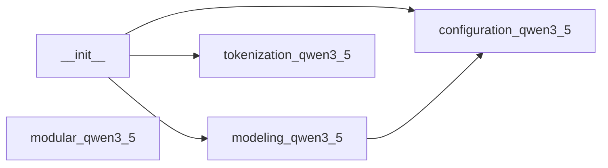

# Codebase Module Report

- Root: `/mnt/code/yehangcheng/llm/model_code/qwen35`
- Source files scanned: `5`
- Modules identified: `5`

## Structure Tree

```text
├── __init__.py
├── configuration_qwen3_5.py
├── modeling_qwen3_5.py
├── modular_qwen3_5.py
└── tokenization_qwen3_5.py
```

## Dependency Graph



## Module Index

| Module | File | Internal deps | External deps (sample) |
|---|---|---:|---|
| `__init__` | `__init__.py` | 3 | ...utils, ...utils.import_utils, sys, typing |
| `configuration_qwen3_5` | `configuration_qwen3_5.py` | 0 | ...configuration_utils, ...modeling_rope_utils |
| `modeling_qwen3_5` | `modeling_qwen3_5.py` | 1 | ..., ...activations, ...cache_utils, ...generation, ...integrations |
| `modular_qwen3_5` | `modular_qwen3_5.py` | 0 | ..., ...cache_utils, ...masking_utils, ...modeling_layers, ...modeling_outputs |
| `tokenization_qwen3_5` | `tokenization_qwen3_5.py` | 0 | ...tokenization_utils_tokenizers, ...utils, tokenizers, tokenizers.models |
