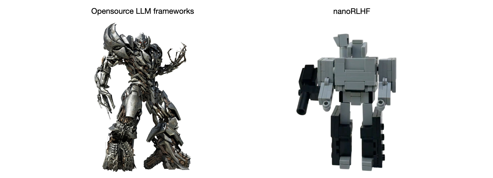
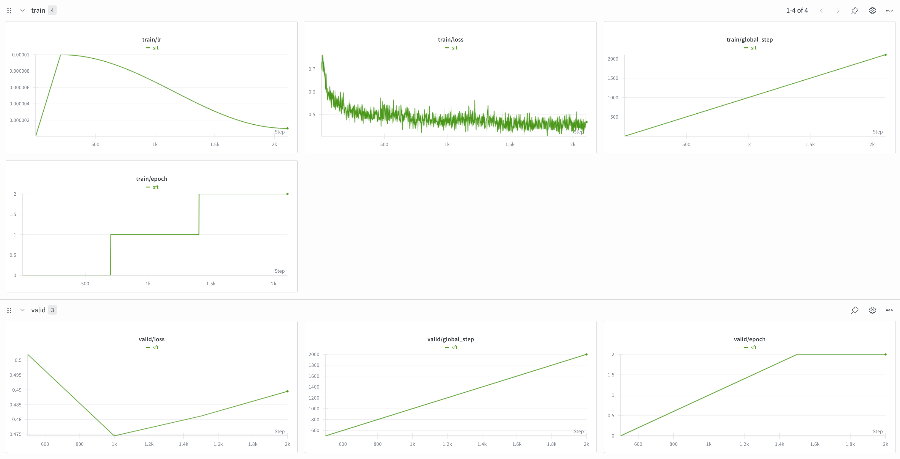
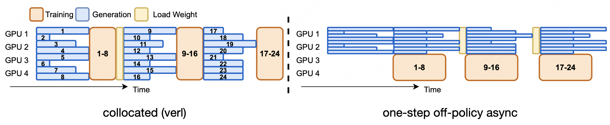
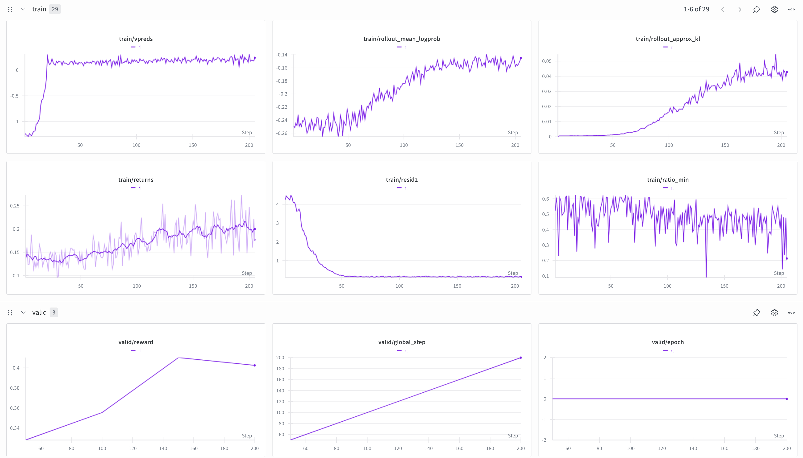

# nanoRLHF

<p align="center">
  <a href="https://github.com/karpathy/nanoGPT">
    
  </a>
</p>

This project aims to perform RLHF training from scratch, implementing almost all core components manually except for PyTorch and Triton. Each module is a minimal, educational reimplementation of large-scale systems focusing on clarity and core concepts rather than production readiness. This includes SFT and RL training pipeline with evaluation, for training a small Qwen3 model on open-source math datasets.

## Motivation
A few years ago, it still felt possible for an individual to meaningfully train and contribute a model, and I was fortunate to do so with [Polyglot-Ko](https://github.com/EleutherAI/polyglot), the first commercially usable open-source Korean LLM, despite not owning a single GPU, thanks to support from the open-source community. But as the field entered an era where large companies train [massive](https://huggingface.co/deepseek-ai/DeepSeek-R1) [models](https://huggingface.co/Qwen/Qwen3-235B-A22B) at unimaginable scale and release them freely, individual efforts began to feel small by comparison. The same shift happened in libraries. [Open sources](https://github.com/volcengine/verl) [maintained](https://github.com/NVIDIA/Megatron-LM) [by full-time corporate teams](https://github.com/langchain-ai/langchain) quickly outpaced what a single person could sustainably build or maintain. I have always loved developing my own open source, but in this reality, facing clear limits in time and capital, I found myself stepping back from it for a while. Eventually, I reframed the question, not how to compete, but how a single person could still create something genuinely useful. Inspired by projects like [Karpathy’s nano series](https://github.com/karpathy/nanoGPT), I returned to building small, clear, educational implementations, focused not on scale or efficiency, but on understanding and teaching. Even without massive resources, I still believe that individuals can create meaningful work that influences and helps others.

## Requirements and Limitations
I worked on this project using a single server with 8 * H200 GPUs.
It should also run well on A100 80GB GPUs, but to fully experiment with all features including 3D parallelism, a server with at least 8 GPUs is required.
Note that this repository only supports single node multi-GPU training, so multi-node distributed training is not supported.

## Installation
In this project, internal APIs from libraries such as Hugging Face Transformers are used in a hacky way, so all dependency versions except PyTorch are strictly pinned.
It is strongly recommended to run the code in an isolated environment such as a Conda virtual environment.

```bash
# 1) create conda environment
conda create -n nanorlhf python=3.10
conda activate nanorlhf

# 2) install PyTorch for your environment from https://pytorch.org/get-started/locally/
# e.g. pip install torch --index-url https://download.pytorch.org/whl/cu126

# 3) install nanoRLHF
git clone https://github.com/hyunwoongko/nanoRLHF
cd nanoRLHF
pip install -e .
```

## Modules
I recommend approaching this repository as a learn-by-building: first install the library, then study the modules, running each module’s example as you go. Once you’ve worked through all modules, finish by running the full RLHF training pipeline end-to-end.

### 1) `nanosets`: Arrow-like Zero-copy Dataset Library
- Implementation: [nanosets](https://github.com/hyunwoongko/nanoRLHF/tree/main/nanorlhf/nanosets)
- Example: [available](https://github.com/hyunwoongko/nanoRLHF/tree/main/examples/nanosets.py)
- References: [arrow](https://github.com/apache/arrow), [datasets](https://github.com/huggingface/datasets)

`nanosets` is a minimal Arrow-like columnar dataset library focusing on zero-copy and clarity.
The goal is to understand how columnar data formats work without copying and how they are implemented from scratch.

### 2) `nanoray`: Distributed Computing Engine
- Implementation: [nanoray](https://github.com/hyunwoongko/nanoRLHF/tree/main/nanorlhf/nanoray)
- Example: [available](https://github.com/hyunwoongko/nanoRLHF/tree/main/examples/nanoray.py)
- References: [ray](https://github.com/ray-project/ray)

`nanoray` is a minimal distributed computing engine inspired by Ray. 
The goal is to understand how distributed execution works and how to build a simple distributed computing framework from scratch.

### 3) `nanotron`: 3D Parallelism Engine
- Implementation: [nanotron](https://github.com/hyunwoongko/nanoRLHF/tree/main/nanorlhf/nanotron)
- Example: [available](https://github.com/hyunwoongko/nanoRLHF/tree/main/examples/nanotron.py)
- References: [Megatron-LM](https://github.com/NVIDIA/Megatron-LM), [oslo](https://github.com/EleutherAI/oslo)

`nanotron` implements 3D parallelism (data, tensor, pipeline) from scratch, focusing on clarity over efficiency. 
The goal is to understand why and how large models are parallelized across many GPUs.

### 4) `kernels`: Set of Triton Kernels
- Implementation: [kernels](https://github.com/hyunwoongko/nanoRLHF/tree/main/nanorlhf/kernels)
- Example: [available](https://github.com/hyunwoongko/nanoRLHF/tree/main/examples/kernels.py)
- References: [flash-attention](https://github.com/Dao-AILab/flash-attention/), [trident](https://github.com/kakaobrain/trident)

`kernels` is a set of custom Triton kernels for LLM training and inference.
The goal is to understand what optimizations matter in practice and how they are implemented at the kernel level.

### 5) `nanovllm`: High Performance Inference Engine
- Implementation: [nanovllm](https://github.com/hyunwoongko/nanoRLHF/tree/main/nanorlhf/nanovllm)
- Example: [available](https://github.com/hyunwoongko/nanoRLHF/tree/main/examples/nanovllm.py)
- References: [vllm](https://github.com/vllm-project/vllm), [nano-vllm](https://github.com/GeeeekExplorer/nano-vllm)

`nanovllm` is a minimal high-performance inference engine for LLMs, built to understand what makes inference fast in practice, including paged attention and efficient batching. 

Thanks to the excellent [nano-vllm](https://github.com/GeeeekExplorer/nano-vllm) project, this module began as a study-driven reimplementation and was then adapted to fit our stack and parallelism design.

### 6) `nanoverl`: RLHF Training Framework
- Implementation: [nanoverl](https://github.com/hyunwoongko/nanoRLHF/tree/main/nanorlhf/nanoverl)
- Example: [available](https://github.com/hyunwoongko/nanoRLHF/tree/main/scripts)
- References: [verl](https://github.com/volcengine/verl), [OpenRLHF](https://github.com/OpenRLHF/OpenRLHF)

`nanoverl` is a minimal RLHF training framework focusing on clarity.
The goal is to understand how RLHF training pipelines are structured, including SFT, RL algorithms and asynchronous RL.

### 7) Full RLHF Training Pipeline
This section is the final step after you have studied all the modules above.

#### Prepare Supervised Fine-tuning Dataset
In the examples included in this project, supervised fine-tuning is performed using [NuminaMath-CoT-Small-Hard-200k](https://huggingface.co/datasets/NotASI/NuminaMath-CoT-Small-Hard-200k).
From the original dataset, 180k samples are used as training data, and 1k samples are used as validation data.
Running the following command will tokenize the dataset and save it as zero-copy `.nano` format (similar with `.arrow` format).

```bash
bash ./scripts/prepare_sft_data.sh
```

#### Supervised Fine-tuning
Supervised fine-tuning is performed using [Qwen3-0.6B-base](https://huggingface.co/Qwen/Qwen3-0.6B-base) model with 3D parallelism by default config.
If you want to modify hyperparameters, please edit `configs/train_sft.yaml` file.
Running the following command will start supervised fine-tuning. Moreover, you can monitor the training process if you have wandb account.



```bash
bash ./scripts/train_sft.sh
```

#### Merge Parallelized Checkpoints
After supervised fine-tuning is completed, the parallelized checkpoints are saved in the directory you specified (default is `./checkpoints`).
To use the model for inference or further training, you need to merge the parallelized checkpoints into a single model checkpoint.
The following script will merge the checkpoints and save them in `$YOUR_CHECKPOINT_PATH/merged` directory.

```bash
bash ./scripts/merge_sft_model.sh $STEP
```

#### Evaluate Supervised Fine-tuned Model
After merging the supervised fine-tuned model, you can evaluate it using the following script.
The evaluation is performed using [MATH-500](https://huggingface.co/datasets/HuggingFaceH4/MATH-500) dataset (500 samples from MATH dataset), and [Math-Verify](https://github.com/huggingface/Math-Verify) is used to parse and verify the model's generated output.

| step  | MATH-500 score |
|------:|----------------:|
| 500   | 40.8            |
| 1000  | 39.4            |
| 1500  | 41.2            |
| 2000  | 43.4            |
| 2109  | 41.8            |

```bash
bash ./scripts/eval_sft_model.sh $STEP
```

#### Prepare Reinforcement Learning Dataset
Reinforcement learning is performed using [DeepMath-103K](https://huggingface.co/datasets/zwhe99/DeepMath-103K) dataset.
I removed samples that have one of 'yes', 'no', 'true' or 'false' as the answer, so about 84k samples are used for training.
And [MATH-500](https://huggingface.co/datasets/HuggingFaceH4/MATH-500) dataset is used for validation.
Running the following command will tokenize the dataset and save it as zero-copy `.nano` format.

```bash
bash ./scripts/prepare_rl_data.sh
```

#### Reinforcement Learning
Reinforcement learning is performed using PPO algorithm with the SFT model at 2000 steps as the initial policy.
To improve training efficiency, [One-step off-policy asynchronous RL](https://github.com/volcengine/verl/tree/main/recipe/one_step_off_policy) is applied.
If you want to modify hyperparameters, please edit `configs/train_rl.yaml` file.
Running the following command will start reinforcement learning. Moreover, you can monitor the training process if you have wandb account.





```bash
bash ./scripts/train_rl.sh
```

#### Merge Parallelized Checkpoints
After reinforcement learning is completed, the parallelized checkpoints are saved in the directory you specified (default is `./checkpoints`).
To use the model for inference or further training, you need to merge the parallelized checkpoints into a single model checkpoint.
The following script will merge the checkpoints and save them in `$YOUR_CHECKPOINT_PATH/merged` directory.

```bash
bash ./scripts/merge_rl_model.sh $STEP
```

#### Evaluate Reinforcement Learning Model
After merging the reinforcement learning model, you can evaluate it using the following script.
The evaluation is performed same as the supervised fine-tuned model using [MATH-500](https://huggingface.co/datasets/HuggingFaceH4/MATH-500) dataset.
Qwen3-0.6B (non-thinking) model is also evaluated as a reference.

| step                      | MATH-500 score |
|---------------------------|----------------:|
| 50                        | 40.8            |
| 100                       | 43.8            |
| 150                       | 46.6            |
| 200                       | 43.8            |
| Qwen3-0.6B (non-thinking) | 49.8            |

```bash
bash ./scripts/eval_rl_model.sh $STEP
```

```bash
bash ./scripts/eval_ref_model.sh
```

## License
This project is licensed under the Apache 2.0 License.

```text
Copyright 2025 Hyunwoong Ko

Licensed under the Apache License, Version 2.0 (the "License");
you may not use this file except in compliance with the License.
You may obtain a copy of the License at

   http://www.apache.org/licenses/LICENSE-2.0

Unless required by applicable law or agreed to in writing, software
distributed under the License is distributed on an "AS IS" BASIS,
WITHOUT WARRANTIES OR CONDITIONS OF ANY KIND, either express or implied.
See the License for the specific language governing permissions and
limitations under the License.
```
